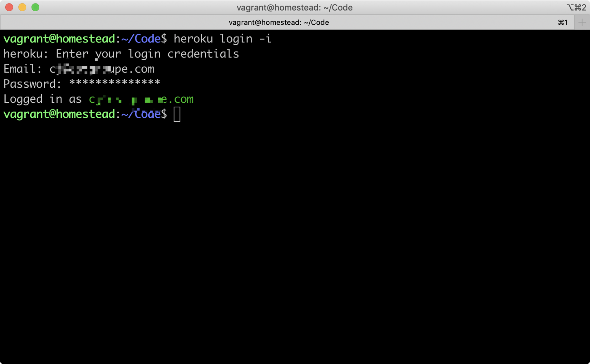
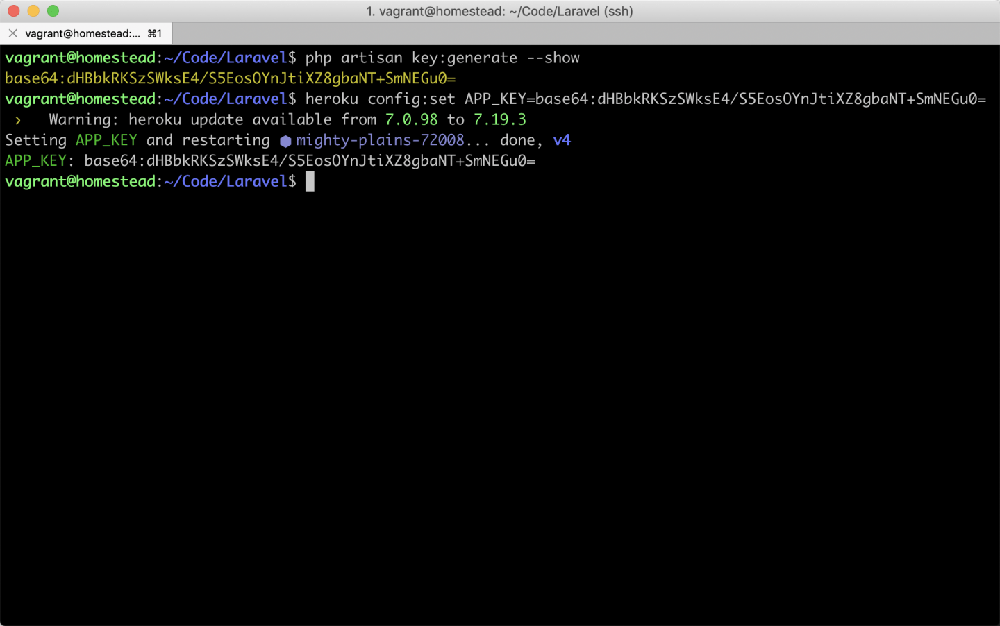

# HerokuにLaravelをデプロイする

Heroku は、複数のプログラミング言語をサポートする PaaS (Platform-as-a-Service) です。 2010年にSalesforceに買収。 最初のクラウド プラットフォームの 1 つである Heroku は、2007 年 6 月に Ruby のみをサポートしていたときに開発を開始し、その後、Java、Node.js、Scala、Clojure、Python、および PHP と Perl のサポートを追加しました。 アプリケーションの展開プロセスが非常にシンプルなため、開発者の間で非常に人気があります。

## Heroku の基本的なインストール構成

まず、Heroku アカウントを登録する必要があります。 Heroku ツールセットは、Heroku が提供する公式のインストール チュートリアルからインストールできます。

インストールが完了したら、次のコマンドを使用して Heroku アカウントにログインできます。

    $ heroku login -i

次に、登録に使用したメール アドレスとパスワードを使用してアカウントにログインします。

  

SSH キーを Heroku に追加します。    

    $ heroku keys:add

アプリケーションを Heroku にデプロイするには、Laravel プロジェクトの下に新しい Procfile ファイルを作成し、Web サーバーを起動するために使用するコマンドを Heroku に指示するようにファイルを構成する必要もあります。 次に、ファイルを Git バージョン管理に入れる必要もあります。

    $ cd ~/Code/Laravel
    $ echo web: vendor/bin/heroku-php-apache2 public/ > Procfile
    $ git add -A
    $ git commit -m "Procfile for Heroku"

## Heroku で新しいアプリを作成するにはどうすればよいですか?

heroku create コマンドを使用して、Heroku で新しいアプリを作成できます。

    $ heroku create
    Creating mighty-hamlet-1982... done, stack is cedar-14
    http://mighty-hamlet-1982.herokuapp.com/ | git@heroku.com:mighty-hamlet-1982.git
    Git remote heroku added

Mighty-hasdagmlyujm-21098 は、アプリ用に Heroku によってランダムに生成されたデフォルトの名前で、全員が異なる名前を生成します。 http://mighty-hasdagmleyujm-21098.herokuapp.com/ は、アプリケーションのオンライン アドレスです。

生成されたデフォルト名に満足できない場合は、heroku rename を使用してアプリ名を変更できますが、変更された名前が他のユーザーに使用されないようにしてください。

    $ heroku rename your-app-name

## 宣言 buildpack

Heroku プラットフォームは複数の言語をサポートしており、アプリケーションがデプロイされると、Heroku はアプリケーションのコードがどの言語で記述されているかを自動的にチェックし、その言語に対して一連の操作を実行して、プログラムの実行環境を準備します。 Laravel アプリケーションにはデフォルトで package.json ファイルが含まれますが、Heroku がこのファイルをチェックすると、アプリケーションが Node.js で記述されていると判断されるため、アプリケーションの buildpack を宣言して、アプリケーションが Written in PHP で記述されていることを Heroku に伝える必要があります. 宣言コマンドは次のとおりです。

    $ heroku buildpacks:set heroku/php

## 設定 APP key

Laravel 使用 App Key 来完成对用户会话及其它信息的编码加密操作，因此我们也需要将 App Key 一同加入到 Heroku 的配置中。

首先，使用 Laravel 自带的 artisan 命令来生成 App Key：      

Laravel はApp Keyを使用して、ユーザー セッションやその他の情報のエンコードと暗号化を完了するため、App Keyを Heroku 構成にも追加する必要があります。

まず、Laravel に付属の artisan コマンドを使用して、App Keyを生成します。

    $ php artisan key:generate --show

  

## デプロイが開始されます

最後に、コードを Heroku にプッシュしてデプロイします。

    git push heroku master
    Counting objects: 4, done.
    Delta compression using up to 4 threads.
    Compressing objects: 100% (4/4), done.
    Writing objects: 100% (4/4), 379 bytes | 0 bytes/s, done.
    Total 4 (delta 3), reused 0 (delta 0)
    remote: Compressing source files... done.
    remote: Building source:
    remote:
    remote: -----> Fetching custom git buildpack... done
    remote: -----> PHP app detected
    remote: -----> Resolved 'composer.lock' requirement for PHP to version 5.6.14.
    remote: -----> Installing system packages...
    remote:        - PHP 5.6.14
    remote:        - Apache 2.4.10
    remote:        - Nginx 1.6.0
    remote: -----> Installing PHP extensions...
    remote:        - mbstring (composer.lock; bundled)
    remote:        - zend-opcache (automatic; bundled)
    remote: -----> Installing dependencies...
    remote:        Composer version 1.1.6-alpha8 2017-11-19 20:41:23
    remote:        Loading composer repositories with package information
    remote:        Installing dependencies from lock file
    ...
    remote:          - Installing laravel/framework (v5.1.19)
    remote:            Downloading: 100%
    remote:
    remote:        Generating optimized autoload files
    remote:        Generating optimized class loader
    remote:        Compiling common classes
    remote: -----> Preparing runtime environment...
    remote: -----> Discovering process types
    remote:        Procfile declares types -> web
    remote:
    remote: -----> Compressing... done, 74.5MB
    remote: -----> Launching... done, v5
    remote:        https://mighty-hasdagmleyujm-21098.herokuapp.com/ deployed to Heroku
    remote:
    remote: Verifying deploy... done.
    To https://git.heroku.com/mighty-hasdagmleyujm-21098.git
    1eb2be6..1b70999  master -> master

コードが正常にプッシュされたら、次のコマンドを使用してオンライン アプリケーションをすばやく開くことができます。

    $ heroku open
ブラウザーで開くことができない場合は、コマンド ライン出力プロンプトに表示されるリンクに従って、直接アクセスできます。

    ▸    Error opening web browser.
    ▸    Error: Exited with code 3
    ▸
    ▸    Manually visit https://mighty-hasdagmleyujm-21098.herokuapp.com/ in your
    ▸    browser.

OK、Laravel アプリケーションのデプロイが完了しました。

  
