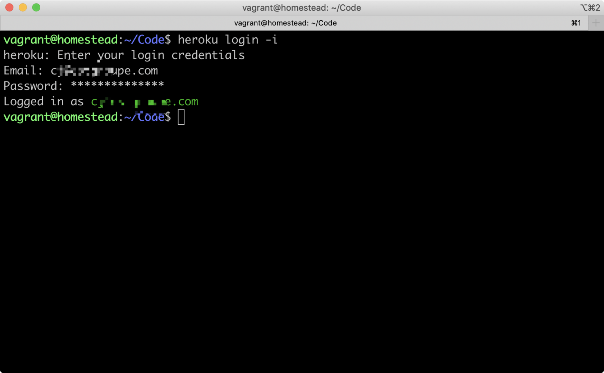
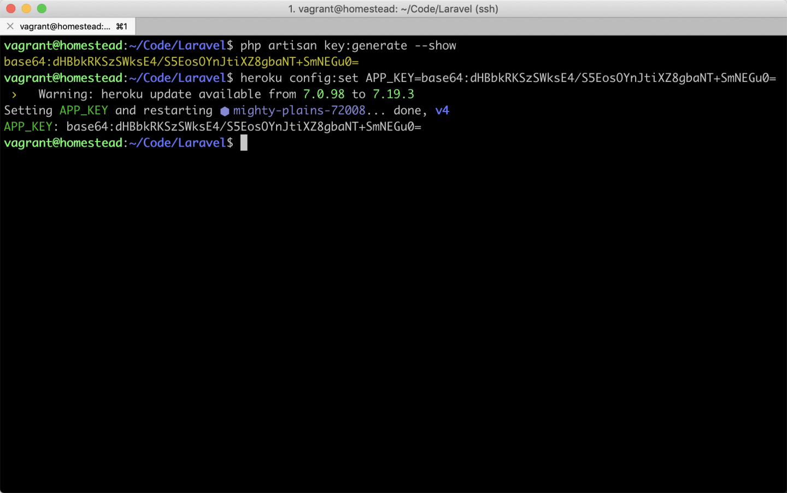
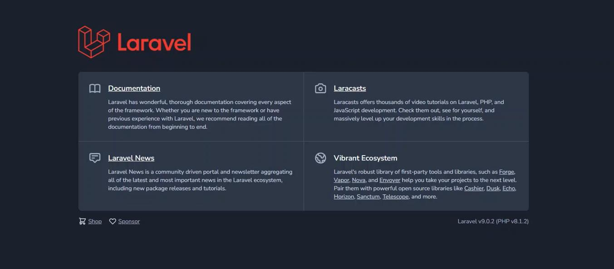

# 部署Laravel到Heroku

Heroku 是一个支持多种编程语言的 PaaS (Platform-as-a-Service)。在 2010 年被 Salesforce 收购。Heroku 作为最开始的云平台之一，从 2007 年 6 月起开始开发，当时它仅支持 Ruby，后来增加了对 Java、Node.js、Scala、Clojure、Python 以及 PHP 和 Perl 的支持。由于其应用部署流程异常简单，因此倍受广大开发者欢迎。

## Heroku 的基本安装配置

首先我们需要先 注册一个 Heroku 账号。

本教程提供的 Homestead 安装包已默认为你安装好了 heroku 命令行工具集，因此我们不必再进行重复安装。如果你使用的不是本教程提供的 Homestead 安装包，则可通过 Heroku 官方提供的 安装教程 进行安装。

安装完成之后我们可以使用以下命令来登录你的 Heroku 账号：  

    $ heroku login -i

然后使用注册使用的邮箱和密码登陆你的账号：

  

添加 SSH Key 到 Heroku 上：

    $ heroku keys:add

要将应用部署到 Heroku 上，我们还需要在 Laravel 项目下新建一个 Procfile 文件，通过配置该文件来告诉 Heroku 应当使用什么命令来启动 Web 服务器。接着还需要将该文件纳入到 Git 版本控制中：

    $ cd ~/Code/Laravel
    $ echo web: vendor/bin/heroku-php-apache2 public/ > Procfile
    $ git add -A
    $ git commit -m "Procfile for Heroku"

## 如何在 Heroku 上创建一个新应用？

我们可以使用 heroku create 命令在 Heroku 上创建一个新应用：

    $ heroku create
    Creating mighty-hamlet-1982... done, stack is cedar-14
    http://mighty-hamlet-1982.herokuapp.com/ | git@heroku.com:mighty-hamlet-1982.git
    Git remote heroku added

mighty-hasdagmleyujm-21098 是 Heroku 随机为应用生成的默认名称，每个人生成的名称都不相同。而 http://mighty-hasdagmleyujm-21098.herokuapp.com/ 则是应用的线上地址。

如果你对生成的默认名称不满意，你可以使用 heroku rename 来对应用名称进行更改，但要保证更改的名称未被其它人占用。如：

    $ heroku rename your-app-name

## 声明 buildpack

Heroku 平台支持多种语言，在进行应用部署时，Heroku 会自动检查应用的代码是用什么语言写的，然后再接着执行一系列针对该语言的操作来准备好程序运行环境。Laravel 应用默认会包含 package.json 文件，但当 Heroku 检查到该文件时，它会认为此应用是用 Node.js 写的，因此我们需要对应用的 buildpack 进行声明，告诉 Heroku 说我们的应用是用 PHP 写的。声明命令如下：

    $ heroku buildpacks:set heroku/php

## 设置 APP key

Laravel 使用 App Key 来完成对用户会话及其它信息的编码加密操作，因此我们也需要将 App Key 一同加入到 Heroku 的配置中。

首先，使用 Laravel 自带的 artisan 命令来生成 App Key：

    $ php artisan key:generate --show
将生成的 App Key 替换掉下面命令的 <your_app_key> ，并运行该命令行来完成配置：

    $ heroku config:set APP_KEY=<your_app_key>

  

## 部署上线

我们要做的最后一步就是将代码推送和部署到 Heroku 上：

    git push heroku master
    Counting objects: 4, done.
    Delta compression using up to 4 threads.
    Compressing objects: 100% (4/4), done.
    Writing objects: 100% (4/4), 379 bytes | 0 bytes/s, done.
    Total 4 (delta 3), reused 0 (delta 0)
    remote: Compressing source files... done.
    remote: Building source:
    remote:
    remote: -----> Fetching custom git buildpack... done
    remote: -----> PHP app detected
    remote: -----> Resolved 'composer.lock' requirement for PHP to version 5.6.14.
    remote: -----> Installing system packages...
    remote:        - PHP 5.6.14
    remote:        - Apache 2.4.10
    remote:        - Nginx 1.6.0
    remote: -----> Installing PHP extensions...
    remote:        - mbstring (composer.lock; bundled)
    remote:        - zend-opcache (automatic; bundled)
    remote: -----> Installing dependencies...
    remote:        Composer version 1.1.6-alpha8 2017-11-19 20:41:23
    remote:        Loading composer repositories with package information
    remote:        Installing dependencies from lock file
    ...
    remote:          - Installing laravel/framework (v5.1.19)
    remote:            Downloading: 100%
    remote:
    remote:        Generating optimized autoload files
    remote:        Generating optimized class loader
    remote:        Compiling common classes
    remote: -----> Preparing runtime environment...
    remote: -----> Discovering process types
    remote:        Procfile declares types -> web
    remote:
    remote: -----> Compressing... done, 74.5MB
    remote: -----> Launching... done, v5
    remote:        https://mighty-hasdagmleyujm-21098.herokuapp.com/ deployed to Heroku
    remote:
    remote: Verifying deploy... done.
    To https://git.heroku.com/mighty-hasdagmleyujm-21098.git
    1eb2be6..1b70999  master -> master

代码推送成功之后，可以使用此命令来快速打开线上应用：

    $ heroku open
如果无法在浏览器打开，可根据命令行输出提示中给出的链接直接访问：

    ▸    Error opening web browser.
    ▸    Error: Exited with code 3
    ▸
    ▸    Manually visit https://mighty-hasdagmleyujm-21098.herokuapp.com/ in your
    ▸    browser.

至此，我们便完成了一个 Laravel 应用的部署。

  

我2006年大学毕业，学的通信工程专业 

2007年5月到2011年11月在亚信集团工作，负责北京电信业务支撑系统(BSS)账务模块的开发和维护 也负责整个系统的数据库维护。
电信业务支撑系统的架构是Oracle数据库，Tuxedo中间件，和Weblogic应用服务器，在工作中使用比较多得技术是JavaWeb开发，PLSQL，Unix系统维护

2011年11月到2016年7月在人人网工作，负责人人网的MySQL数据库维护，和网站的数据统计。
数据库共有2000多个MySQL实例，总数据量大概50TB，部署在近1000台Linux服务器上；运维工作包括数据库的在线备份，优化，迁移，使用MHA搭建高可用架构，使用Zabbix监控整个数据库集群。
开发基于MySQL数据库的统计平台，对应网站运营的各种数据统计需求。底层数据统计使用的Python开发，前端使用PHP开发。

2016年7月至今在东软集团工作，目前负责区块链相关产品的开发。
基于Hyperleger Fabric的联盟链运维平台和联盟链跨链平台。
后台技术使用Golang/Java(Springboot) 前端技术使用（Vue2/3）

在东软申请了7个专利

比较擅长的是业务系统的开发，和数据库的运维。

喜欢日本很长时间了，但是一直工作和家庭的事情都很忙，转眼马上就40岁了，希望可以实现这个心愿，日本很文明，商业和教育都很发达，还喜欢日本的电视剧《白色巨塔》，《半泽直树》，《昼颜》。。；，我女儿8岁了，希望她可以在日本上学。当然这也要看她自己的意愿。 选择去日本是因为喜欢日本的生活方式。

我喜欢接受新的挑战，可以很快融入全新的环境，希望可以发挥我的长项，例如程序开发和数据库运维， 也希望不久的將來可以和目前一樣独当一面。

学了不到半年日语。目前还在学习中。

目前工作也比较顺利，只是缺少挑战性和成就感。